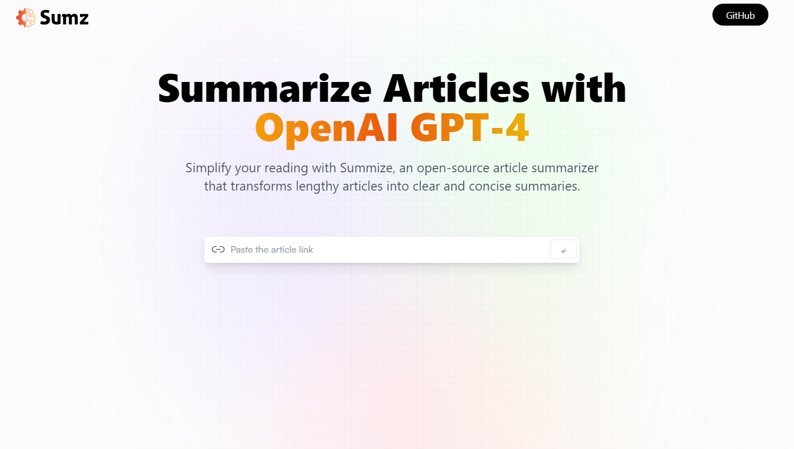

  
  <h1>An AI Article-Summarizer Website</h1>

  
## 📋 <a name="table">Table of Contents</a>
1. 🔗 [Demo](#links)
2. 🤖 [Introduction](#introduction)
3. ⚙️ [Tech Stack](#tech-stack)
4. 🔋 [Features](#features)

## <a name="links">🔗 Demo</a>
You can see a live demo of this website [here.](https://chat-summarizer.netlify.app/)

## <a name="introduction">🤖 Introduction</a>
Summarize any kind of article with just one click using the powerful OpenAI model. It turns lengthy articles into quick summaries Just by  pasting a link of an article.

## <a name="tech-stack">⚙️ Tech Stack</a>
- React.js
- TypeScript
- Redux Toolkit
- Tailwind CSS

## <a name="features">🔋 Features</a>
👉 **Modern User Interface**: A modern and user-friendly interface, offering an intuitive experience for users.

👉 **Summary Generation**: Users can input the URL of a lengthy article, and the web app utilizes AI to provide a concise summary of the article content.

👉 **History Saving with Local Storage**: The app includes a history feature, allowing users to save summaries locally, providing a convenient way to revisit and manage their reading history.

👉 **Copy to Clipboard Functionality**: Enables users to easily share or store the summarized content by copying it to their clipboard.

👉 **Advanced RTK Query API Requests**: Utilizes the advanced capabilities of Redux Toolkit (RTK) Query for making API requests. These requests fire conditionally based on specific criteria, optimizing data fetching and management.
